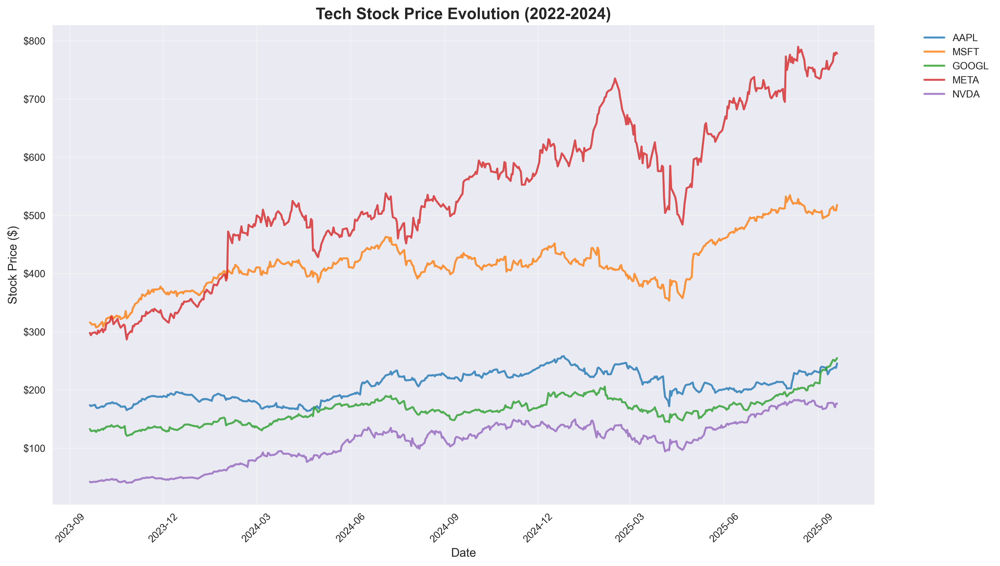
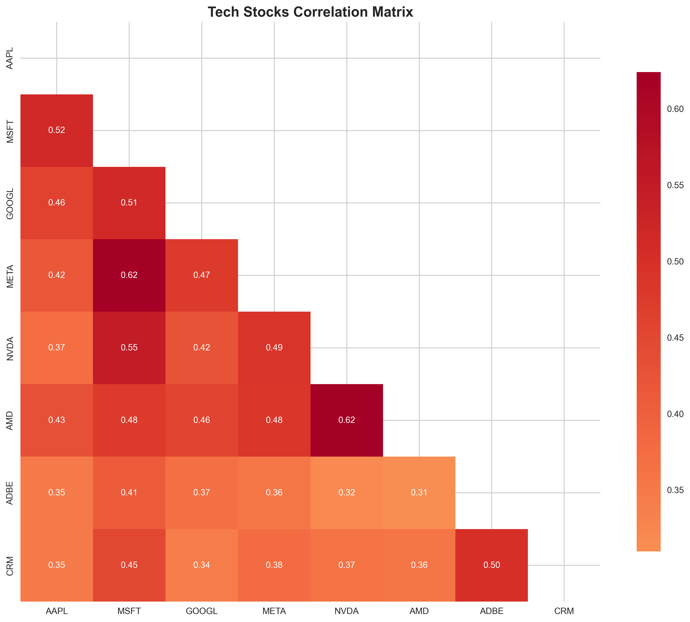

#  Financial Market Analytics Dashboard


A comprehensive data visualization project across 8+ Python visualization libraries through financial market analysis. This project analyzes S&P 500 stocks using various visualization tools, from simple plots to interactive web applications.

##  Project Overview

This project showcases the complete data visualization pipeline for financial market analysis, covering:
- **Data Collection**: Real-time stock market data from Yahoo Finance
- **Data Processing**: Technical indicators, risk metrics, and portfolio analysis
- **Visualization**: 7 different Python libraries 
- **Web Application**: Interactive Dash dashboard
- **Professional Documentation**: Complete implementation guide

##  Live Demonstrations

### Interactive Visualizations
- **Plotly Dashboard**: Multi-stock comparison with time series
- **Bokeh Risk Analysis**: Interactive risk-return scatter plots
- **Altair Correlation**: Grammar of graphics approach to market analysis
- **Folium Maps**: Geographic visualization of company locations
- **Dash Web App**: Full-stack financial analytics application

### Static Analysis
- **Matplotlib**: Professional candlestick charts and technical analysis
- **Seaborn**: Statistical correlation and distribution analysis


## 📁 Project Structure

```
financial-market-analytics/

├── 📂 notebooks/         # Jupyter notebooks (implementation order)
│   ├── 01_data_collection.ipynb
│   ├── 02_matplotlib_basics.ipynb
│   ├── 03_seaborn_analysis.ipynb
│   ├── 04_plotly_interactive.ipynb
│   ├── 05_bokeh_dashboard.ipynb
│   ├── 06_altair_grammar.ipynb
│   ├── 07_folium_geographic.ipynb
│   └── 08_dash_webapp.ipynb
    ├── 📂 data/
│       ├── raw/              # Original collected data
│       ├── processed/        # Cleaned and analyzed data
│       └── external/         # Additional datasets
    ├── 📂 static/            # Generated visualizations
│       ├── images/           # Static plots (PNG format)
│       └── *.html           # Interactive visualizations
├── 📂 src/               # Source code modules
│   ├── __init__.py
│   ├── data_collection.py    # Data collection utilities
│   ├── data_processing.py    # Analysis and metrics calculation
│   ├── visualization_utils.py # Common visualization functions
│   └── config.py             # Configuration and constants
├── 📂 dashboards/        # Web applications
│   └── dash_app/         # Dash application files
├── requirements.txt      # Python dependencies
└── README.md            # Project documentation
```

##  Skills Demonstrated

### Data Visualization Mastery
- **Static Visualization**: Professional-quality plots with Matplotlib
- **Statistical Analysis**: Advanced correlation and distribution analysis with Seaborn
- **Interactive Charts**: Dynamic dashboards with Plotly and Bokeh
- **Grammar of Graphics**: Declarative visualization with Altair
- **Geographic Analysis**: Location-based insights with Folium
- **Web Applications**: Full-stack dashboard development with Dash

### Financial Analysis Expertise
- **Technical Analysis**: Moving averages, RSI, Bollinger Bands
- **Risk Management**: VaR, CVaR, Sharpe Ratio, Maximum Drawdown
- **Portfolio Optimization**: Mean-variance optimization, efficient frontier
- **Sector Analysis**: Performance comparison across industry sectors
- **Market Intelligence**: Correlation analysis, volatility clustering

### Software Engineering Best Practices
- **Modular Architecture**: Clean, reusable code organization
- **Documentation**: Comprehensive inline and project documentation
- **Error Handling**: Robust data collection and processing
- **Version Control**: Git-based development workflow
- **Testing**: Data validation and visualization testing

##  Quick Start Guide

### 1. Environment Setup

```bash
# Clone repository
git clone https://github.com/RamuNalla/financial-market-analysis-dashboard.git
cd financial-market-analytics

# Create virtual environment
python -m venv myenv
myenv\Scripts\activate

# Install dependencies
pip install -r requirements.txt
```

### 2. Data Collection

```bash
# Run data collection
python src/data_collection.py
```

This will:
- Collect 2+ years of data for 50 S&P 500 stocks
- Calculate technical indicators (MA, RSI, etc.)
- Save processed data for analysis
- Generate master price dataset

### 3. Execute Analysis Notebooks

Launch Jupyter and run notebooks in sequence:

```bash
jupyter notebook
```

**Recommended execution order:**
1. `01_data_collection.ipynb` - Data setup and validation
2. `02_matplotlib_basics.ipynb` - Static visualization fundamentals
3. `03_seaborn_analysis.ipynb` - Statistical analysis and correlations
4. `04_plotly_interactive.ipynb` - Interactive charts and dashboards
5. `05_bokeh_dashboard.ipynb` - Web-based interactive visualizations
6. `06_altair_grammar.ipynb` - Grammar of graphics approach
7. `07_folium_geographic.ipynb` - Geographic market analysis
8. `08_dash_webapp.ipynb` - Web application development

### 4. Launch Dash Application

```bash
cd dashboards/dash_app
python app.py
```

Visit `http://localhost:8050` to interact with the full-featured financial dashboard.

##  Dataset Overview

### Stock Universe
- **50 S&P 500 companies** across 10 major sectors
- **2+ years of daily data** (2022-2024)
- **Real-time collection** via Yahoo Finance API

### Data Points per Stock
- **OHLCV Data**: Open, High, Low, Close, Volume
- **Technical Indicators**: 20/50-day moving averages, RSI
- **Derived Metrics**: Daily returns, volatility, drawdowns
- **Company Information**: Market cap, sector, industry classification

### Analysis Scope
- **Risk Metrics**: Volatility, VaR, Sharpe ratio, maximum drawdown
- **Performance Metrics**: YTD returns, annualized performance
- **Correlation Analysis**: Cross-asset and sector correlations
- **Portfolio Analytics**: Optimization, attribution, benchmarking

##  Visualization Showcase

### Matplotlib - Professional Static Charts

- Candlestick charts with volume analysis
- Technical indicator analysis
- Multi-stock performance comparison
- Returns distribution analysis

### Seaborn - Statistical Visualizations

- Correlation heatmaps with hierarchical clustering
- Sector performance box plots
- Risk-return scatter plots
- Distribution analysis

### Plotly - Interactive Dashboards
- 3D scatter plots (Price vs Volume vs Market Cap)
- Time series with range selectors and crossfilters
- Interactive correlation matrices
- Sector performance sunburst charts

### Bokeh - Web-Based Interactivity
- Linked plots with brushing and selection
- Real-time data streaming capabilities
- Custom JavaScript callbacks
- Professional dashboard layouts

### Altair - Grammar of Graphics
- Declarative visualization syntax
- Multi-faceted analysis with automatic legends
- Interactive filtering and selection
- Statistical transformations and aggregations

### Folium - Geographic Analysis
- Market cap bubble maps
- Company headquarters visualization
- Sector clustering by geography
- Performance heat maps by region

### Dash - Full-Stack Web Application
- **Market Overview**: Multi-stock comparison and sector analysis
- **Individual Stock Analysis**: Technical indicators and performance metrics
- **Portfolio Builder**: Interactive allocation and optimization
- **Risk Dashboard**: Comprehensive risk analytics and stress testing


### Tool Performance Comparison
| Library | Strengths | Best Use Cases | Learning Curve |
|---------|-----------|----------------|----------------|
| Matplotlib | Publication quality, full control | Academic papers, reports | Easy |
| Seaborn | Statistical analysis, attractive defaults | Exploratory analysis | Easy |
| Plotly | Interactive, web-ready | Executive dashboards | Medium |
| Bokeh | Advanced interactivity, scalability | Large datasets, web apps | Hard |
| Altair | Grammar of graphics, concise syntax | Analytical exploration | Medium |
| Folium | Geographic visualization | Location-based analysis | Easy |
| Dash | Full applications, callbacks | Production dashboards | Hard |


## 🚀 Future Enhancements

### Planned Features
- **Machine Learning Integration**: Predictive modeling with scikit-learn
- **Real-time Data Streaming**: WebSocket integration for live updates


## 📄 License

This project is licensed under the MIT License - see the [LICENSE](LICENSE) file for details.


⭐ **If you found this project helpful, please consider giving it a star!**

This project represents a comprehensive exploration of Python's data visualization ecosystem applied to real-world financial analysis. Whether you're learning data visualization, exploring financial markets, or building professional dashboards, this project provides practical examples and production-ready code.